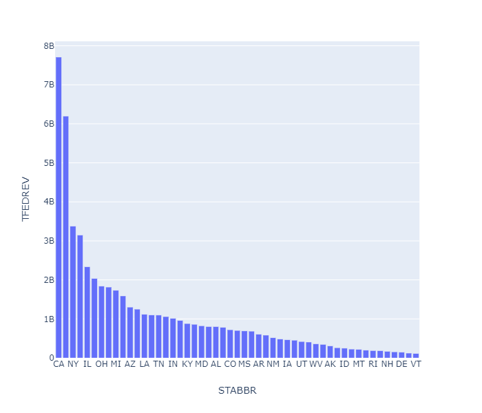
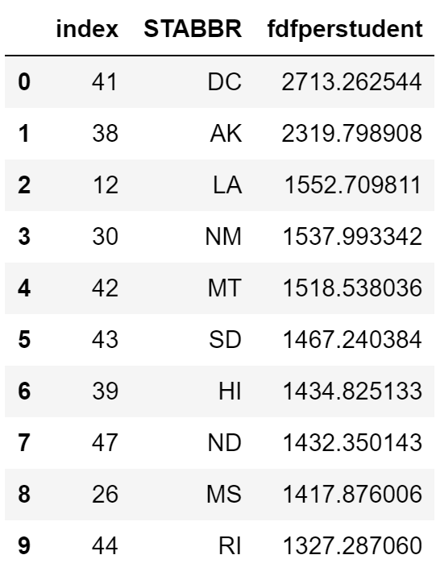

# DS5500_Homework3

For All Work that is not readable, open the notebook here: https://nbviewer.jupyter.org/.

## Problem 1

The above figure shows the amount of federal funding each state receives. California receives the most. 

Below, is a table of the top ten states that have federal funding per student.

## Problem 2
