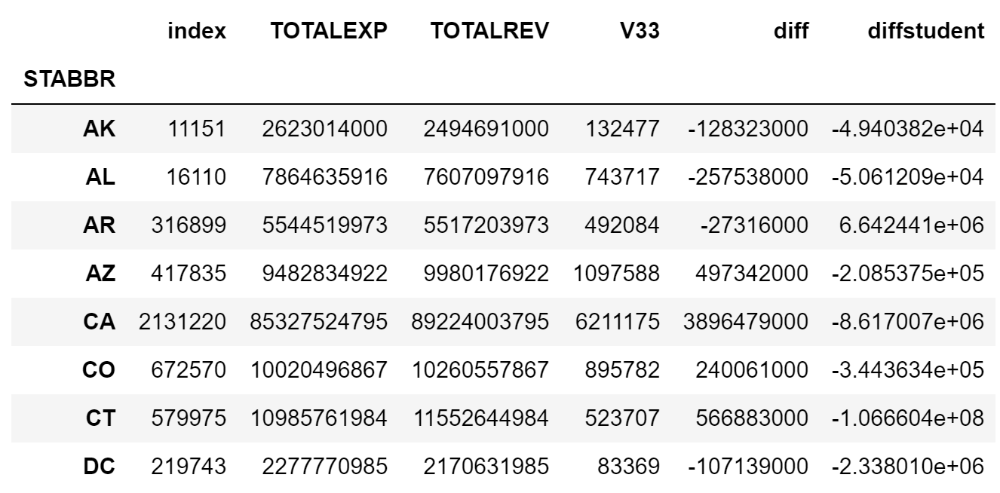

# DS5500_Homework3

For All Work that is not readable, open the notebook here: https://nbviewer.jupyter.org/.

## Problem 1

The above figure shows the amount of federal funding each state receives. California receives the most. 

Below, is a table of the top ten states that have federal funding per student.

## Problem 2

The following plot shows the relationship between district revenue and expenditure.

The following table shows the state debt by student.

## Problem 3

The explaination of the function and the function is listed in the DS5000_Homework3 notebook and can be viewed here: https://nbviewer.jupyter.org/.

The function parses each string. Based on the length and character values it determines the range for a sample. I then select a sample from either a uniform distribution or normal distribution from the range determined by the string characters. 

I decided to visualize the math performance of the entire districts. The figure below demonstrates the results.

## Problem 4

## Problem 5

In order to reduce the Federal Budget by 15% we must make cuts to Federally funded programs. The following criteria are the rules by which funding was cut. 1.) Determine all districts that had a positive difference between their funding and their expenditure. 2.) Reduce district federal funding by the difference or by the federal funding whichever was smaller. 3.) Determine whether the reduction was greater than needed. If so, iteratively reduce the reduction among all schools that had funding taken until the reduction equalled 15% of last year's budget.

This process was chose because it is clear, generally objective, and does not impact the learning of the schools that the money is being taken from.
